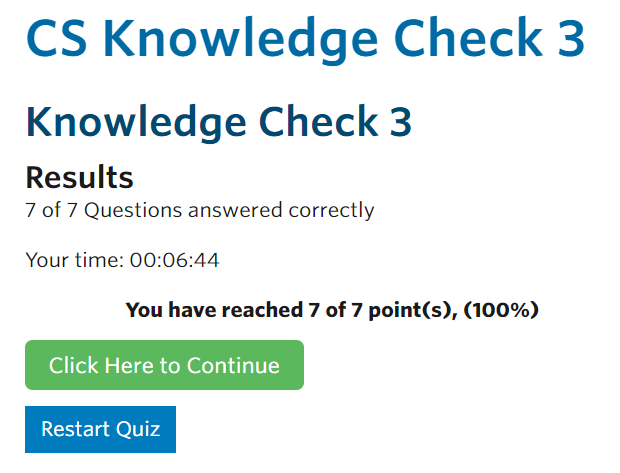

<h3>
    <b>KEAMANAN JARINGAN</b> 
    "APNIC MODULE 3 SUMMARY"
</h3> 

 

Dosen Pengampu: 
Ferry Astika Saputra, S.T., M.Sc.
  

Disusun Oleh: 
Jihan Ghaniyyah Putri Arrochim (3122640035)
 

    <b>
        KELAS 1 D4 LJ IT B  
        JURUSAN D4 LJ TEKNIK INFORMATIKA  
        DEPARTEMEN TEKNIK INFORMATIKA DAN KOMPUTER   
        POLITEKNIK ELEKTRONIKA NEGERI SURABAYA  
        2023
    </b>

   

<h3 align="center">APNIC MODULE 2: CYBER SECURITY CONTROLS</h3> 

<a href="https://www.bitsight.com/blog/cybersecurity-controls-types#:~:text=What%20are%20cybersecurity%20controls%3F,the%20threats%20to%20network%20data.">**Cyber Security Controls**</a> atau kontrol keamanan siber adalah proses yang dimiliki suatu organisasi untuk melindungi dari kerentanan jaringan yang berbahaya dan dapat meretas data organisasi. Adanya kontrol keamanan siber, suatu organisasi dapat mendeteksi dan mengelola ancaman terhadap data jaringan.   

### Countermeasures or Managing Risk

Countermeasures atau memanajemen risiko sebagai tindak pengamanan kontrol keamanan (simply control) terhadap data jaringan suatu organisasi terdiri dari 3 jenis, yaitu:

1.  <a href="https://www.bitsight.com/blog/cybersecurity-controls-types#:~:text=What%20are%20cybersecurity%20controls%3F,the%20threats%20to%20network%20data">**Practices or ogranizational structures**</a> (People)
    Tim cyber security memiliki peranan yang sangat penting karena tim tersebut bertanggung jawab menangani kerentanan pada sistem, menafsirkan data, dan membuat keputusan yang tepat untuk dapat mencegah pelanggaran data. Tentu tim tersebut harus memiliki role/peran yang jelas agar dapat siap menghadapi ancaman yang tak terduga pada data jaringan organisasi.
     
2.  <a href="https://www.tripwire.com/state-of-security/understanding-policies-control-objectives-standards-guidelines-procedures">**Policies & Procedures**</a>
    Policies atau kebijakan, merupakan sebuah high-level statement dari manajemen yang menetapkan persyaratan untuk memandu pengambilan keputusan dan ditegakkan oleh standar yang selanjutnya dilaksanakan oleh prosedur. Prosedur merupakan tanggung jawab pemelihara aset untuk membangun dan mendukung standar dan kebijakan (policies).   
3.  <a href="https://www.tripwire.com/state-of-security/understanding-policies-control-objectives-standards-guidelines-procedures">**Guidelines**</a>
    Guidelines atau pedoman, merupakan praktik yang direkomendasikan dan bertujuan untuk membantu meningkatkan standar ketika kebijakan (policies) dijalankan.
     
4.  **Standards** (Framework)
    Framework atau standar keamanan merupakan serangkaian dokumentasi yang berhubungan dengan proses, tindakan, dan konfigurasi. Berikut adalah beberapa framework cyber security yang populer digunakan, diantaranya:
    a. <a href="https://www.iso.org/isoiec-27001-information-security.html">ISO 27000 Series (Information Security Management System)</a>
    b. <a href="https://www.nist.gov/cyberframework">NIST Cyber Security Framework</a>
    c. <a href="https://www.pcisecuritystandards.org/">Payment Card Infustri Data Security Standard (PCI DSS)</a>
    d. <a href="https://www.cisecurity.org/controls">CIS Critical Security Controls</a>

### Penerapan Security Control

1. **Security Policies**
   Kebijakan keamanan pada dasarnya menggambarkan apa saja yang harus dilakukan untuk melindungi aset data dan jaringan pada suatu organisasi. Security policies biasanya berbentuk dokumen yang mecakup beberapa bidang, seperti:
   a. Back-up Policies
   b. IT Asset Usage Policies
   c. Password Policies
   d. Internet Policies
   Sangat penting bahwa kebijakan keamanan dibagikan kepada setiap pemangku kepentingan sehingga mereka menyadari tanggung jawab dan harapan organisasi.
2. **Firewalls**
   Firewall dapat mencegah akses tidak sah pada suatu komputer atau jaringan. Firewall dapat berupa hardware atau software yang berjalan pada komputer dan bertinfak sebagai gateway.Host-Based Firewall merupakan software yang berjalan pada perangkat end user yang hanya melindungi komputer end user tersebut.
    - Memeriksa lalu lintas berdasarkan policies kemudian memblokir atau mengizinkannya. Hal ini juga berguna untuk membatasi akses ke sistem atau layanan tertentu.
    - Menyaring (filter) lalu lintas berdasarkan sumber dan tujuan (nomor port), jenis jaringan lalu lintas atau atribut paket jaringan.
3. **Anti-Malware**
   Perangkat lunak anti-malware dapat melindungi kita dari virus dan ancaman malware lainnya termasuk trojan, ransomware, worm, dan spyware. Karena malware cenderung berkembang dengan cepat, penting untuk dipastikan bahwa solusi anti-malware memiliki informasi yang terbaru agar proses deteksi menjadi lebih efektif.
4. **Vulnerabiity Management**
   Manajemen kerentanan adalah praktik siklus yang bertujuan untuk mengidentifikasi, mengklasifikasikan, memulihkan, dan mengurangi kerentanan. Hal ini penting karena terkadang, kerentanan ditemukan dalam perangkat lunak atau firmware yang memungkinkan musuh untuk mendapatkan akses tidak sah ke jaringan atau data. Menerapkan patches atau update secara tepat waktu adalah contoh hasil dari proses ini.
5. **Intrusion Detection System**
   Intrusion Detection System (IDS) adalah device atau perangkat lunak yang memantau jaringan dan sistem terhadap malicious activity. IDS melakukan scan terhatap:
    - Menyelidiki isi paket dan cari atribut yang terkait dengan aktivitas berbahaya atau pelanggaran kebijakan. Kegiatan ini kemudian dicatat dan akan diberitahukan kepada administrator sehingga tindakan lebih lanjut dapat diambil.
    - Dapat berbasis jaringan atau host.
    - Beroperasi sebagai pendeteksi atau sebagai Sistem Pencegahan Intrusi (IPS) untuk memblokir atau menghentikan aktivitas jahat.
6. **Encryption**
   Solusi enkripsi mengamankan data Anda dengan mengenkripsi sistem file, jaringan transaksi, media yang dapat dipindahkan, dan email. Data dan informasi yang dienkripsi hanya dapat diakses dengan kunci yang tepat atau kata sandi. Sebagai penangulangan, sangat penting sebuah perlindungan informasi rahasia untuk mengurangi dampak dari kebocoran atau pencurian data. Dalam organisasi, enkripsi banyak digunakan dalam protokol jaringan (SSH, HTTPS, VPN), dan email (PGP/SMIME).
7. **Two-Factor Authentication (2FA)**
   Otentikasi Dua Faktor adalah metode untuk mengonfirmasi identitas yang diklaim pengguna dengan memanfaatkan kombinasi dari dua komponen yang berbeda. 2FA secara signifikan mengurangi risiko penyerang mengakses akun online dengan menggabungkan kata sandi (sesuatu yang Anda ketahui) dengan faktor kedua, seperti ponsel atau token perangkat keras (sesuatu yang Anda miliki). Karena meningkatnya jumlah pelanggaran yang disebabkan oleh kata sandi yang lemah atau dicuri, banyak organisasi menerapkan 2FA ke semua sistem mereka.
    - Login menggunakan username atau password seperti login biasanya
    - Pilih cara mendapatkan kode verifikasi
    - Masukkan 2FA kode yang anda dapatkan
8. **Security Audit**
   Security Audit adalah penilaian teknis yang terukur dari suatu sistem atau aplikasi. Penilaian dapat melalui wawancara, security vulnerability scans, dan menganalisa akses fisik ke sistem.
9. **Incident Response and Handling**
   Bersiap untuk menanggapi dan menangani insiden keamanan adalah penting dalam meminimalkan dampak pelanggaran atau serangan keamanan dan pemulihan dengan cepat. Memiliki kemampuan ini berarti ada prosedur untuk:

    - Mendeteksi berbagai jenis insiden keamanan
    - Hapus akar penyebab insiden
    - Pulihkan ke keadaan pra-insiden
    - Tinjau pelajaran yang dipetik dari insiden tersebut untuk perbaikan di masa mendatang

    Beberapa organisasi memiliki tim respons keamanan khusus (CERT/CSIRT) yang memiliki keterampilan dalam melakukan analisis log, investigasi malware, dan digital forensik. CSIRT terkadang juga berfungsi dengan entitas eksternal seperti lembaga penegak hukum, operator jaringan atau CERT pemerintah.

10. **Education and Training**
    Memiliki budaya keamanan yang kuat sangat penting dalam melindungi organisasi. Keamanan tidak dapat dicapai tanpa dukungan semua pihak pemangku kepentingan dalam organisasi. Staf juga perlu menyadari pentingnya keamanan, kebijakan, tindakan pencegahan, peran dan tanggung jawabnya. Semua Ini dapat dicapai melalui kampanye kesadaran keamanandan, pelatihan dan destop exercise.

### Quiz Score

